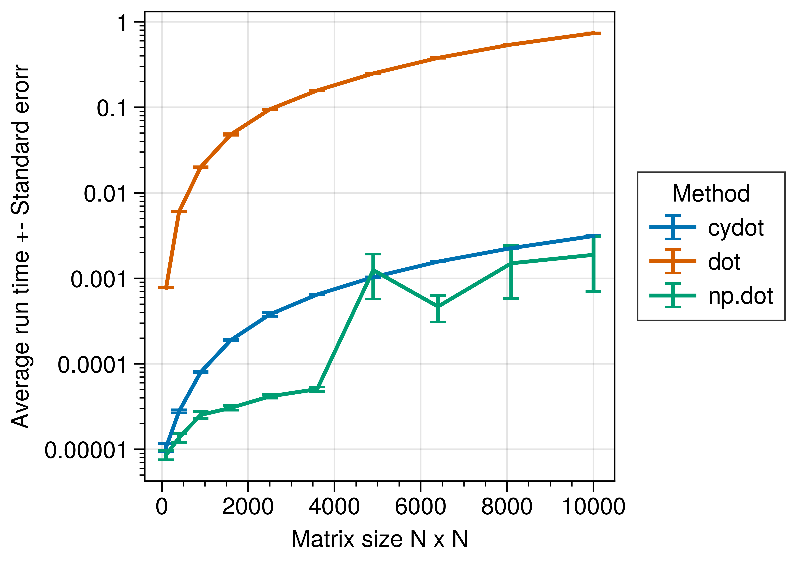

# Table of Contents

1.  [What are header files?](#org47f4632)
2.  [Cython pure mode](#orgb06f8c3)
3.  [Benchmarks](#orgbcf09bc)
4.  [Summary](#org9f605fb)

In  coding there  is  a trade-off  between writing  abstract
code,  and high  performant  code. This  trade-off is  often
embodied  in different  languages.  For  example, python  is
considered  to  be an  abstract  language  whereas C++/C  is
considered a  low level language. Abstract  languages allows
for rapid  prototyping while hiding away  the implementation
details in packages or modules.  A key strategy for abstract
languages is  providing high level interfaces  for low-level
implementations  allowing  for  a   &ldquo;best  of  both  worlds&rdquo;
scenario,   improving  the   performance  of   the  abstract
language. However, there are cases in which the code written
is within  the ecosystem of  the abstract language,  yet the
performance needs to increase. For  python there are ways to
improve  the performance  of python  code. For  example, one
could use  Numba to utilize the  Just-In-Time-Compiler (JIT)
or  use a  specialized compiled  version of  python such  as
pyston. Cython  offers yet another way  by compiling special
&ldquo;pyx&rdquo; files into a shared object that can then be interfaced
with from  python, creating a hybrid  language between C/C++
and          python          (see          my          prior
[post
on
cython templates](https://cvanelteren.github.io/post/cython_templates/)). Cython has the advantage of leveraging the
existing  python stack,  and  enhancing it  with faster  run
time. It works specifically well if the original python code
contains a  lot of for  loops that cannot be  optimized away
by other  means. Although the cython  ecosystem has matured
quite  a lot  in recent  years, it  requires knowledge  from
other  languages to  implement algorithms  efficiently. This
creates a  gap for python  developers wanting to have  a bit
more performance.

A more recent development  is compiling existing python code
in &ldquo;pure&rdquo; mode in cython. In pure mode, the original code is
left  untouched (i.e.  the `.py`  file) and  the performance
enhancing code is written in a special header file (`.pxd`).
This  has the  advantage for  increasing the  performance of
existing python code while  retaining the compatibility with
non-cython  users. I  [recently](https://github.com/cvanelteren/networkx/commit/7f7f3b8ff923917f42a6101f7e27e5b7396d2828)  implemented the  forceatlas2
layout in cython&rsquo;s pure mode  to gain a 400 percent increase
over the traditional python code.

In this  post, I  wish to introduce  the reader  to cython&rsquo;s
pure mode and  test some simple benchmarks to  see what kind
of performance boosts we can have.

# What are header files?

In traditional  compiled languages such as  C/C++ the source
code  is split  into  the implementation  and header  files.
Header  files can  be  thought of  as the  index  of a  book,
whereas  the  source files  can  be  thought of  the  actual
content of a  book&rsquo;s chapter. The header  file instructs the
compiler  (and the  programmer) on  what is  present in  the
implementation and  how external code can  interface with it.
In python,  the concept of  source and header file  does not
exist. The closest thing I can think of is showing what kind
of class properties a class has. Something similar to,

    class Chicken:
        mass = 0
        height = 0
        def __init__(self, name):
            self.name = name
    
    
    Karl = Chicken("Karl")
    print(f"My name is {Karl.name} and I weight {Karl.mass} kg")

    My name is Karl and I weight 0 kg

Here, the  variables `mass` and `height`  are defined before
the class is inititalized. It  tells the programmer that the
class  `Chicken`   has  two  class  properties   `mass`  and
`height`. A  python programmer would put  these variables in
the class  constructor as  these are individual  traits. The
use of init function is general  is not the same as this use
case. For the init function  may transform the values passed
to the  object, whereas here  `mass` and `height`  are clear
class traits.

# Cython pure mode

Cython&rsquo;s  pure  mode  takes  an  existing  python  file  and
augments it  by an header  file. Often this header  file has
the  same name  as the  original  python file  but with  the
extension `.pxd` (or definition file). Let&rsquo;s take an example
function. Assume we want to  implement a matrix dot product.
A naive implementation will look something like this:

    #file: dot.py
    import numpy as np
    def dot(A: np.ndarray, B: np.ndarray) ->  np.ndarray:
        m, n = A.shape
        k = B.shape[1]
        assert n == B.shape[0], "matrices A and B are not alligned"
        output = np.zeros((m, k))
        for idx in range(m):
            for jdx in range(n):
                for kdx in range(k):
                    output[idx, kdx] += A[idx, jdx] * B[jdx, kdx]
        return output

Testing  the code  for speed  we can  confirm that  this dot
product is quite slow.

    import numpy as np
    A = np.eye(10)
    B = np.eye(10)
    %timeit -n10 -r10 dot(A, B)

    595 µs ± 301 µs per loop (mean ± std. dev. of 10 runs, 10 loops each)

In comparison the numpy implementation
is about 200 times faster

    import numpy as np
    %timeit -n10 -r10 np.dot(A, B)

    The slowest run took 26.21 times longer than the fastest. This could mean that an intermediate result is being cached.
    7.48 µs ± 16 µs per loop (mean ± std. dev. of 10 runs, 10 loops each)

Let&rsquo;s say we really like our dot implementation, but we wish
the python code  was a bit faster. For cython  pure mode, we
would need to augment the py  file with pxd file. The header
file would need to contain

-   The functions name
-   The functions return type
-   The functions input arguments

We create the file `dot.pxd` and fill in the header as follows:

    # file: dot.pxd
    # distutils: language = c++
    # or c if you want c
    import cython
    @cython.locals(m = size_t, n = size_t, k = size_t,
                   idx = size_t, jdx = size_t, kdx = size_t,
                   output = double[:, ::1])
    cpdef double[:, ::1] dot(double[:, ::1] A, double[:, ::1] B)

What exactly  happened here?  The \`cython.locals\`  tells the
compiled  which  variables  are   declared  inside  the  dot
function in the py file. It tells the compile what the types
are. The function description is exposed through cython with
the `cpdef`  statement. This  exposes the function  to calls
from  python in  the `.so`  file.  Next the  return type  is
given. Here a memoryview is used. These are raw buffers that
can  be  directly converted  from  numpy.  They have  faster
access  than normal  the normal  numpy arrays.  Using memory
views has the disadvantages that  the numpy methods that are
defined on  the array  are disable.  For example  one cannot
call `A.sum`  or `A.mean` or `A.reshape`  anymore when using
memory  views. An alternative  would be  to use  \`np.ndarray\`
however these are still considered  to be python objects and
therefore  do  not  have  increased speed  compared  to  the
memoryviews.

We then compile the source code either from a setup file(not
covered  but  preferred in  modules)  or  directly from  the
commandline with

`cythonize build_ext --inplace dot.py`

which produces an .so file. Let&rsquo;s test the speed!

    from dot import dot as cydot
    %timeit -n10 -r10 cydot(A, B)

    4.11 µs ± 557 ns per loop (mean ± std. dev. of 10 runs, 10 loops each)

Which   is  a   nearly  200   percent  increase   in  speed!
Importantly,  it   is  nearly   on  par  with   the  numpy&rsquo;s
implementation!

# Benchmarks

Let&rsquo;s  benchmark  the  results  to  see  how  the  different
implementations scale with matrix size.

# Summary

Cython can  be used  to speed up  existing python  code. The
preferred way  is to  use cython pyx  files with  pxd header
files. An alternative is to use cython pure mode to speed up
existing  python   code.  Pure  mode  allows   for  smoother
collaboration with numerical experts and python developers.

