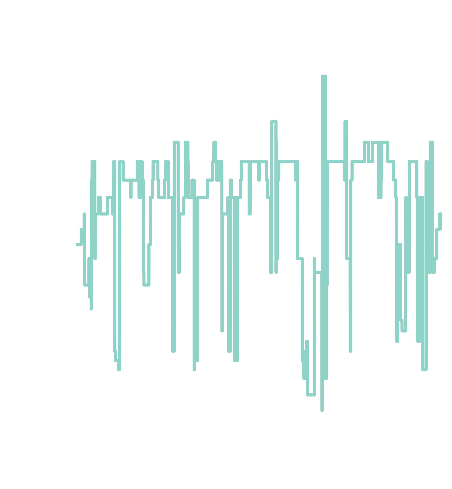

Jimi Hendrix is arguable one of the greatest rock artists of all time. He
pioneered rock with progressive psychedelic songs pushing the boundaries of what
is possible on the guitar. Listening to Hendrix shows high dynamic from more
popular songs like Hey Joe, Manic Depression to more niche songs such as Valleys
of Neptune. Years ago I was practicing Black Dog by Led Zeppelin when my drum
teacher at the time notices something; on the X minute mark Bonham is not on the
beat. At the time this blew my mind: How is it possible that an infamous rock
song like Black Dog is not kept in time? Artists fine tune their skill to play
perfectly in time don&rsquo;t they?

In a modern recording studio a technique called quantizing is used to smooth out
the rough edges if an artist is slightly off beat. With this technique the audio
is modified such that the bar of a beat are perfectly kept at some target Beats
Per Minute or BPM. The music in the 60s and 70s were filled with musical
innovation and some argue that the application of modern mixing and sound
editing techniques removes the &ldquo;spirit&rdquo; that was so characteristic of the early
days of modern music.

<figure>
 
 <figcaption> Fluctuation of BPM in Axis Bold as Love by the Jimi hendrix Experience</figcaption>
</figure>

About a year ago, I watched a video by [Paul Davids](https://www.youtube.com/watch?v=Q-3oFreydHo&t=509s) that discussed the song &ldquo;Axis
Bold as Love&rdquo; by the Jimi Hendrix experience. Paul Davids noticed the exact same
thing my teacher noticed all those years ago: Hendrix was not playing in time.
The song still sounds amazing but the BPMS modulate all over the place as the
song progresses, yet in the charts, the song is played at a fixed BPM. The
observation resonated with me as it coincided with the same observation as my
teacher had on Zeppelin&rsquo;s black dog. This prompted me to set out to look at
songs from different eras to see how the BPMs modulated over the progression of
the song.

<figure>
 
 <figcaption> Tempo estimates for music from different eras and different genres. Tempo estimates were performed using ~librosa~ python package.
 </figcaption>
</figure>

A few things have to be mentioned. First, it is natural for songs to have a
variation in BPM. That is a part of the song may be played at halftime or
contain a change in tempo. However, what I am referring to here is that for some
songs the charts state that the BPM is fixed or no there is no mention of an
increase in tempo. The patterns observed here are seemingly not tied to a
specific part that in the song with that demarcation. Second, Paul Davids in his
original video manually matched the BPM to the song. Here, I used the librosa
python package to estimate the BPM for various songs. The estimation process is
not without artifacts. For example consider Parcel&rsquo;s lightenup (2018); this band
is known for very tight pockets and melodic grooves. I expected that this band
would show very homogeneous BPMs for the duration of the song. This is confirmed
by the lack of deviation form the 123(ish) BPM. However, in the beginning and
end of the song there is an artifact where the BPMS rise upwards of 150. I
believe this is an artifact from the estimation procedure that `librosa`
performs. Some of the BPMs changes need to be taken with grain of salt. However
yet, one can still see that as we move towards the modern age, the songs become
&ldquo;cleaner&rdquo; in terms of the BMPs. Importantly, this trend occurs across different
genres. From disco/funk (Earth wind and fire) to rap (NWA) and blues/rock (John
Mayer) to pop (Parcels).

Music is a form of artistic expression. When striving towards perfection one may
think of drawing a perfect circle or following rules like the golden ratio. Each
of these songs are considered staples of their era, each of these songs are
filled with artistic expression. As I take home message I would like to leave
the reader with an appreciation that perfection perhaps sometimes is being imperfect.

