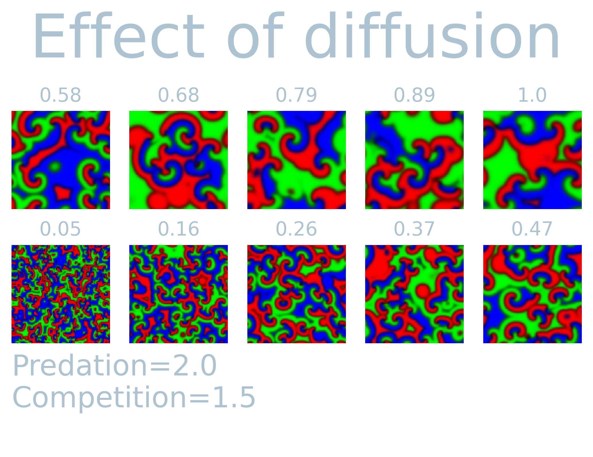

Some  years ago  an  <a href  url="https://www.nature.com/articles/nature06095">
article  </a>  was published  using  rock-paper-scissor  dynamics to  study  the
effects  on  biodiversity.  I  got  inspired by  the  excellent  website  of  <a
href="https://www.complexity-explorables.org/explorables/cycledelic/">Dirck
Brockmann  </a>   and  decided   to  implement   it  myself   in  the   <a  href
url="https://github.com/cvanelteren/Plexsim"> the computational  toolbox I wrote
</a>. Below  I simulated  the rock-paper-scissor model  and created  a (possibly
novel)  agent-based  inspired  version  of  it.  The  model  produces  beautiful
fluid-like patterns  as can be  seen in the video  below simulated on  a 100x100
grid with Moore neighborhood.

<figure>    <video    width="auto"    height="auto"    controls loop autoplay>    <source
src="rock_paper_scissor_dynamics.mp4" type="video/mp4">   </video>  <figcaption>   Simulation  of
rock-paper-scissor dynamics on a 100x100 grid with Moore neighborhood. The model
starts with all  vertices having a random  value in $[0, 1]$. The  color of each
vertex is proportional to the density of the species (red, green or blue). White
would indicate low values of all  species whereas black indicates high values of
all species.  Over time  larger patches  of similar  states appear  and interact
according to rock-paper-scissor dynamics. </figure>

# The model
The model was designed to understand the co-existance of interacting species in a spatially extended ecosystem. Each vertex point represents the locus of three species. 
The color (red, green, blue) are proportional to the density
of the three species at each pixel (vertex point).

The  model produces  a wide  range of  different patterns  based on  three input
parameters

- Diffusion ($D$): mobility of species.
- Predation ($P$): competition between the tree different species.
- Competition ($C$): Competition among different specifies.

Each vertex in the system $\sigma_i  \in \sigma :=${ $\sigma_0, \dots, \sigma_n$
} contains a  vector with the density  of the three "species",  i.e. rock ($r$),
paper ($g$), or scissor ($b$). The concentration of each specie at vertex $i$ is
updated according to

$$
\frac{d \sigma_i}{dt} = \scriptstyle \begin{cases}
  \frac{dr_i}{dt}& = ((\underbrace{P  (g_i - b_i)  + r_i}\_{\textrm{predation}} - \underbrace{C  (g_i + b_i) - r_i^2}\_{\textrm{Competition}})r_i - \underbrace{D(\sum_{<i,j>} r_j r_i)}\_{\textrm{mobility}}\) \delta t \\\\\\
  \frac{dg_i}{dt}& = ((P  (b_i - r_i)  + g_i - C  (r_i + b_i) - g_i^2)g_i - D(\sum_{<i,j>} g_j g_i)) \delta t \\\\\\
  \frac{db_i}{dt}& = ((P  (r_i - g_i)  + b_i - C  (r_i + g_i) - b_i^2)b_i - D(\sum_{<i,j>} b_j b_i)) \delta t, \end{cases}
$$

where $<i,j>$ indicates the nearest neighbors of variable $i$. 

In order to see  the effect of the three parameters,  I simulated $T=1000$ steps
and visualized  the last system  state while varying predation,  competition and
diffusion while keeping the rest constant.  It is fascinating to see
how each parameter causes different spatially extended patterns. The simulations
over time exhibit  fluid-like behavior, and the observed  patterns are distinct
on the set of input parameters.  Most notably, the diffusion parameter can cause
large extended  patches similar to  what can  be observed in  Ising/Potts model.
Predation on  the other hand tends  to cause fragmentation of  species for lower
values, but  for higher values  create similar larger patterns.  The interaction
among the variables shows a non-linear  effect with each other. This can readily
be seen in the competition parameters.  That is, the competition parameter shows
larger patches  only for  a small range  (1.89 - 2.17)  while keeping  all other
values constant.

# Agent-based implementation
In the original paper, the authors apply a so-called Gillspie algorithm to efficiently sample the reaction between the different density. I was interested whether one can get away with "tradtiional" Monte-Carlo methods and implemented and agent-based approach to the model above.

Each agent updates stochastically with parameters
- Mobility $M \in [0, 1]$
- Reproduction $R \in [0, 1]$
- Selection $S \in [0, 1]$

An agent can only reproduce if an adjacent vertex is dead. The other moves are updated sequentially with the probabilities indicated above. In short, each agent can assume one of 4 states:

0. Dead state
1. "Rock" state
2. "Paper" state
3. "Scissor" state

Each update step an agent interacts  with a random neighbor and randomly chooses
an interaction strategy random. That is, if the adjacent neighbor is empty, it could reproduce with probability $R$, otherwise it may attempt kill the neighbor with probability $S$. Lastly, it could inhabit the neighboring site with probability $M$. Note that the total set is a pair of (mobility, selection or reproduction).

We then yield the following for $(M, R, S) \rightarrow 2.5:1.5:.05 = 1.3:1:0.03 \rightarrow (.5, .66, 0.016)$:

<figure>
<video  width="auto" height="auto" controls autoplay loop>  <source src="rock_paper_scissor_dynamics_abm.mp4"> </video>

<figcaption> Agent-based implementation of the model above. Black indicates dead or uninhabited vertices, red, yellow, green represent rock, paper, scissor state respectively. The dynamics are simulated on a 100x100 lattice with Moore neighborhood.
</figure>

This maintains the circular behavior found in the original paper, however this does not employ the Gillspie algorithm. This will be the topic of some future post. 

<!-- <video id="video" controls autplay loop> -->
<!-- <source src="test.webm">  -->
<!-- </video> -->
<!-- here -->
