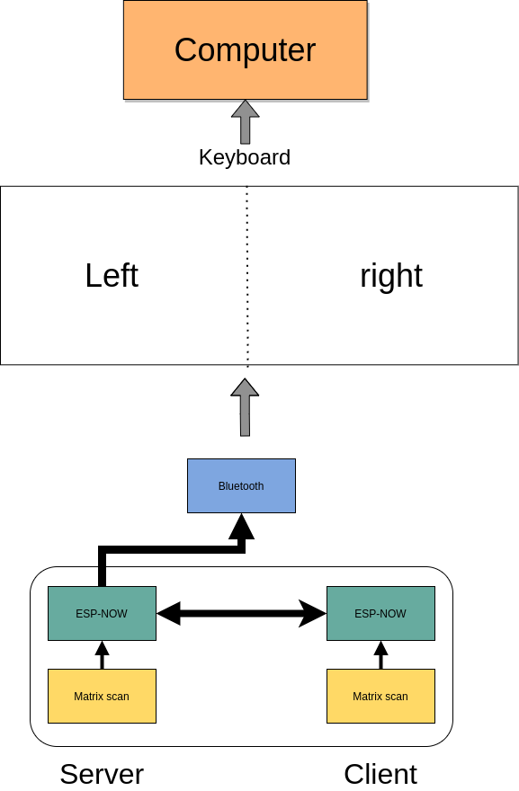
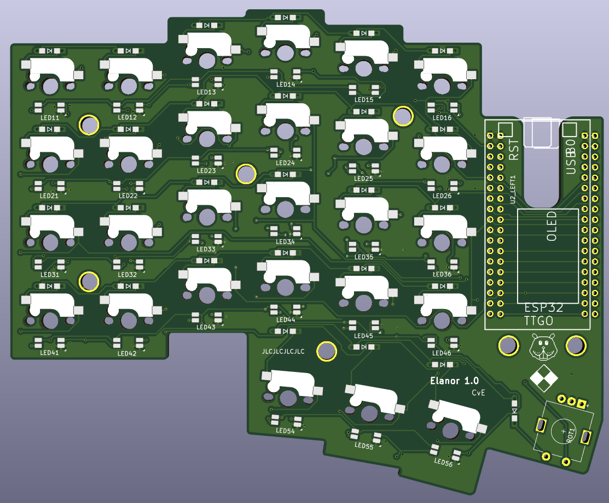
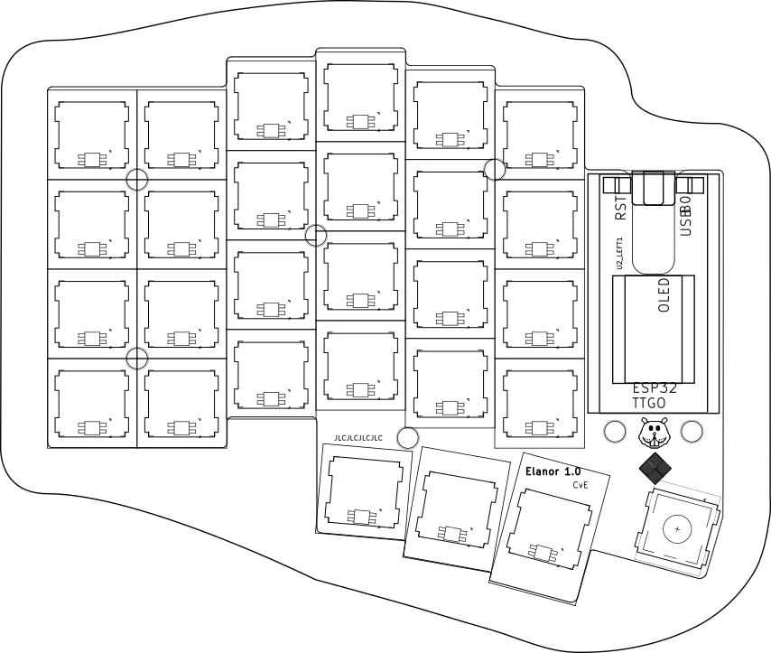

*TLDR: I wanted a wireless split keyboard, so I made one.
This post outlines the process.*

</img>

# Table of Contents

1.  [Introduction](#orga56ed27)
2.  [Outline](#org07c9ff9)
3.  [ESP32](#org8341c49)
4.  [Matrix scanning](#org1f8f18e)
    1.  [Ghosting](#org3d9c27c)
    2.  [Key debouncing](#orgb6c4bce)
    3.  [Changes](#org1551f4d)
5.  [ESP-Now](#org80acce2)
    1.  [Mesh interface class](#org5d2fa59)
    2.  [Changes](#org7b6376a)
    3.  [Replacing ESP now with BLE mesh](#org10d9a33)
6.  [Modifier keys](#org5920043)
    1.  [Changes](#orgaf157bd)
7.  [Bluetooth](#org4196787)
    1.  [Changes](#orgef9da12)
8.  [Keyboard layers](#org4affbc2)
    1.  [Changes](#org5c9dfaa)
9.  [Rotary encoder](#orgfe759ee)
    1.  [Taming the KY-040 with decoding](#orgccf6ee7)
    2.  [Changes](#org30de569)
10. [LED driver: FastLED](#orgff0649f)
    1.  [Changes](#org894745e)
11. [OLED Display](#org19921c7)
    1.  [Changes](#orgf9d2835)
12. [Deep sleep](#org1b1a44a)
    1.  [Changes](#org28fc435)
13. [Battery control](#org6d70429)
    1.  [Changes](#org1314ffd)
    2.  [Reference](#org899ac2c)
14. [PCB layout design](#orgbc724cc)
    1.  [Making the layout](#orgf94a89d)
    2.  [Edge cut pcb](#org5365539)
15. [Case design](#org7b992ab)
16. [Specialized keys](#org37935b8)
    1.  [Layer taps](#orgc6993cf)
    2.  [One shot modifier keys](#org9fe2de3)
    3.  [Leader key](#orge641ca8)
17. [Replacing esp\_now](#org204445e)
    1.  [BLE in a nutshell](#org79d4be3)
    2.  [Integration with BLE keyboard](#org0ad4064)
    3.  [Changes](#orga8c659e)

# Introduction

&lt;2021-06-21 Mon&gt;
Mechanical keyboards  are somewhat  of a dated  concept that
has  gathered some  speed in  more recent  years. Back  when
computers were  first coming  out for the  public, keyboards
had  mechanical connections  that would  allow a  current to
activate a  switch. Then as  economics got wind,  somehow we
got used  to membrane  keyboards; virtually every  office in
the  world   has  these  membrane  keyboards.   Compared  to
mechanical keyboards, membrane  keyboards feel more &ldquo;mushy&rdquo;.
In contrast,  mechanical keyboards  may have  different feel
based  on  the  springs  or  whether the  key  switch  has  a
noticeable  &ldquo;bump&rdquo;.   They  can   be  clicky  or   not;  the
possibility are wild now.

A  few  years  ago  I started  following  the  subreddit  on
mechanical keyboards.  Back then,  the community  had little
options and cherry still had patents on the switches. Cherry
MX keys were virtually found in every commercial keyboard on
the market. Now,  the landscape has changed quite  a bit and
more and more different types of switches are available.

Why do  I prefer mechanical keyboards?  Mechanical keyboards
give a &ldquo;joy&rdquo; to typing.  Membrane keyboards are fine to type
on, but  they aren&rsquo;t fun.  Generally my fingers  get &ldquo;tired&rdquo;
after typing  on membrane keyboards  as the keys feel  a bit
mushy, i.e.  you get no relief  when pushing down a  key and
the key press does not feel crisp.

After  following  / r / mechanicalkeyboards   for  a  while,  I
decided to  *build* my  own keyboard. Within  the community,
there is a wide variety  of switches and shapes of keyboards
available. The one I wanted, an orthonormal keyboard, wasn&rsquo;t
commercially available. Plus I liked the idea of building my
own keyboard.  In my work,  the keyboard is my  primary tool
and why not  key a custom version of it  for myself. I ended
up  building 2  handwired  versions of  65  percent with  85
switches  in  a  grid  layout.   In  addition,  I  modded  a
MagSafe-inspired cable to it which allowed it to be nice and
portable. After  every build I told  myself : &ldquo; This  is the
last one I&rsquo;ll build&rdquo;.

Enter  this blog,  where I  again tell  myself &ldquo;this  is the
last  one I  build!&rdquo;. What  changed? Since  I learned  about
split-style keyboard,  I always wanted one.  The keyboards I
had  made   so  far  weren&rsquo;t.  Split   would  be  completely
ergonomical,  but  unfortunately,  none (that  I  know  of)
exists that are both (a) wireless and (b) split. As always
I aimed to high and wanted to emulate the many features that
QMK implements. Most importantly, I  wanted to get back into
writing more low  level languages like c++, and  I take this
project as  a nice  opportunity to get  into c++  again, and
work with micro-controllers.

This post  will serve as  my log for building  the keyboard.
The post will updated as I work on it.

Core feature targets

-   Split wireless keyboard
-   Hot swappable key sockets
-   Portable, not a full keyboard
-   Battery control
-   OLED display
-   Rotary encoders

# Outline

The keyboard is split; it has two halves. The right and left
half will have  most of the same  &ldquo;base&rdquo; functionality. Most
importantly, each  half needs to  scan the matrix  to obtain
which keys are being pressed. One of the halves will act as a
server, the other will act as a client. The server will need
the following capabilities

**Server abilities**

-   Read matrix
-   Setup a bluetooth connection
    -   HID Device
    -   Mouse emulation
-   Setup connection with client
    -   Merge keys pressed and send to bluetooth controller
-   Control LEDs on both client and server

**Client abilities**

-   Read matrix
-   Find server and send pressed keys to server

Due to the heavier load of  the server, I prefer to make the
role of  who is server and  who is client dynamic.  That is,
with some heuristic (for example  deep sleep), the roles may
switch to prolong batter life of both units.

To give a course overview consider the following picture:

# ESP32

&lt;2021-07-12 Mon&gt;-
I  opted for  a micro-controller  as this  would allow  me to
prototype without  worrying about my electronic  skills. The
controller needed  to have  battery control,  bluetooth, and
preferable an  energy efficient screen;  I ended up  with an
esp32.

The esp32 is a hybrid chip that has both Wi-Fi and bluetooth
capabilities. The esp32 consists  of different versions that
varies in (mainly) in the number of pins, battery connector,
and  or screen.  The version  I ended  with (LORA-V2)  had a
battery connector and a tiny OLED screen.

The  ecosystem  of  ESP32   is  well-developed  albeit  less
convenient  than  its  arduino  counterparts.  Luckily,  the
opensource community has taken it upon themselves to provide
lots  of  arduino bindings  to  the  libraries by  espressif
(manufacturer of esp32).

Especially important  (as it turned  out later) is  that the
esp32 has the capabilities of using both Wi-Fi and bluetooth
low  energy simultanaously.  In  addition, through  ESP-NOW,
different  eps32  modules can  form  a  mesh, which  I  will
harness to do server-client communication.

For prototype 1, the following pinout was used

<table border="2" cellspacing="0" cellpadding="6" rules="groups" frame="hsides">

<colgroup>
<col  class="org-right" />

<col  class="org-left" />
</colgroup>
<tbody>
<tr>
<td class="org-right">pin</td>
<td class="org-left">use</td>
</tr>

<tr>
<td class="org-right">13</td>
<td class="org-left">row 2</td>
</tr>

<tr>
<td class="org-right">12</td>
<td class="org-left">row 3</td>
</tr>

<tr>
<td class="org-right">14</td>
<td class="org-left">row 4</td>
</tr>

<tr>
<td class="org-right">27</td>
<td class="org-left">row 5</td>
</tr>

<tr>
<td class="org-right">26</td>
<td class="org-left">column 6</td>
</tr>

<tr>
<td class="org-right">25</td>
<td class="org-left">led input</td>
</tr>

<tr>
<td class="org-right">0</td>
<td class="org-left">row 1</td>
</tr>

<tr>
<td class="org-right">18</td>
<td class="org-left">column 1</td>
</tr>

<tr>
<td class="org-right">23</td>
<td class="org-left">column 2</td>
</tr>

<tr>
<td class="org-right">19</td>
<td class="org-left">column 3</td>
</tr>

<tr>
<td class="org-right">22</td>
<td class="org-left">column 4</td>
</tr>

<tr>
<td class="org-right">21</td>
<td class="org-left">column 5</td>
</tr>

<tr>
<td class="org-right">17</td>
<td class="org-left">rotary encoder A</td>
</tr>

<tr>
<td class="org-right">5</td>
<td class="org-left">rotary encoder B</td>
</tr>
</tbody>
</table>

Pin 4 could still be used as a modulated pin
for measuring the battery.

# Matrix scanning

&lt;2021-07-12 Mon&gt;  A keyboard  matrix scanning circuit is used
to enhance the  number of keys, while keeping  the number of
pins low.  A micro-controller uses general  pin input/output
(GPIO) to  register currents.  If a  singular key  switch is
wired to  a single pin,  96 pins would  be needed for  a 104
sized keyboard (full-size). This would be unpractical.

As an alternative  one could apply matrix  scanning. In this
method,  the keys  are wired  as  a grid  where each  column
connects to each  row effectively forming a  &ldquo;switch&rdquo;. For a
total for 100 keys, one would need 10x10 grid. The grid acts
as a force multiplier for the number of switches. Instead of
needing 100  separate keys,  we merely need  10 rows  and 10
columns (20 pins) to wire our 100 switch keyboard.

The  matrix is  repeatedly  scanned to  determine  if a  row
column form  an open circuit.  That is,  if a key  switch is
pressed down, current  can flow between the  row and column.
The scanning occurs at a high scan rate, making it seemingly
instantaneous.

## Ghosting

Matrix  scanning  forms  an excellent  idea  to  efficiently
represent our electronic  switches. However, merely scanning
does  not  correctly records  all  key  presses. Under  some
conditions, a matrix  can record ghost keys,  i.e. keys that
are  registered  but not  pressed.  This  process is  called
ghosting.

Ghosting  occurs  when  current   can  freely  flow  between
separate  rows or  columns due  to another  row/column being
open.  For example  consider a  simple two  row, two  column
keyboard. This board can support 4 keys. When two keys along
the diagonal  are pressed,  we register  4 keys(!).  This is
obviously wrong and  needs to be corrected.  The most common
approach is to put a diode  right after the switch either on
the columns or rows,  which prevents current from traversing
and causing ghosting.

 one key is pressed down bottom left. (Middle) A key across from the first is activated which causes ghosting (right); current flows from the second row, first column to the second row, second column etc.")

## Key debouncing

Key  debounce is  a mechanism  to filter  out erroneous  key
activity.  When  two metal  plates  come  into contact,  the
signal does not form a clean  square wave. In order to clean
up  this  signal, key  debouncing  is  used to  reflect  the
&ldquo;press&rdquo;  of  key switch.  Initially  I  used a  simple  time
filter, i.e.  ensuring that  the keyswitch was  pressed down
between  x ms.  This ended  up being  a bit  noisy with  the
switches I  was using; I  ended up writing a  digital filter
that worked fairly well.

## Changes

-   [X] Added matrix class
    -   [X] added matrix scan
    -   [X] added key debounce
    -   [X] added (whole) matrix debounce
        -   [X] filters out erroneous key presses

# ESP-Now

&lt;2021-06-19 Sat&gt;
The two  halves need to  communicate to each other.  There is
only one half that is connected through bluetooth to another
device. We call  this the server, and the  other the client.
Keys pressed on  the client needs to be  communicated to the
server  which   processes  the  keys,  and   sends  it  over
bluetooth. Luckily,  ESP-now offers a mesh  interface we can
utilize for  this purpose.  This is easier  to setup  than a
bluetooth mesh interface and should be relatively secure for
foreign attackers. From the website we read:

> ESP-NOW is yet another protocol developed by Espressif, which enables multiple devices to communicate with one another without using Wi-Fi. The protocol is similar to the low-power 2.4GHz wireless connectivity that is often deployed in wireless mouses. So, the pairing between devices is needed prior to their communication. After the pairing is done, the connection is secure and peer-to-peer, with no handshake being required.

## Mesh interface class

The mesh class is responsible for:

-   Setup / deinit the ESP-now connection
-   Holding a buffer that is sent over the ESP-now connection.
    The buffer holds information that needs to be communicated
    between each  halves.

At  the moment  of writing,  the mesh  class holds  a static
buffer   which  holds   \`keyswitch\_t\`.  These   are  structs
containing when the last time  the pins were read as active.
In addition, it contains information  on the source and sinc
pins, and column and row indices. These last two are used to
index into the final keymap on the server side. This way, no
actual key information is send, but the server reads the key
from the  col and row,  then they are combined.  This solves
the issue of sending ascii shifted codes or media keys.

## Changes

-   [X] Implemented mesh interface class
-   [X] Added server capabilities to join the keys from both half and communicate through bluetooth

## Replacing ESP now with BLE mesh

The current consumption  of esp now is too  high to reliable
use on battery. By replacing ESP now with a BLE alternative,
the current  consumption can be  reduced by 50  percent. ESP
offers a novel  BLE mesh functionality which may  serve as a
replacement for ESP now.

-   What functions does BLE mesh have?
-   BLE mesh can send 11 octets (88 bits) of information. This
    is significantly less than 250 of esp now(!).

# Modifier keys

&lt;2021-07-26 Mon&gt;    My  initial implementation  measures  the
onset of  keys. That is,  debounce worked by  measuring when
the &ldquo;square  wave&rdquo; of the  key was pressed. This  allows for
fast  and  accurate  detection  detecting  key  press  down.
Initially my intentions was to merge the other keys together
such that multiple keys are registered at the same time. For
example, the shift key needs to register two keys at minimum
to shift the ascii code around for let&rsquo;s say \`a\` to \`A\`.

Consequently, I need to both  register the key press down as
well as the  key release; I modified  the debounce mechanism
to also detect the key release.

## Changes

-   [X] Change key detection. Register key press and key release
-   [X] Mesh buffer management is moved out of the keyboard class.
-   [X] Fixed wrong indexing in reading the active keys on the server.

# Bluetooth

Bluetooth  is  rather  complicated. The  Bluetooth  Keyboard
class takes  care of  most of the  heavy lifting.  Key codes
have an associated  ascii code, these are put  into an ascii
code map. Note that the over bluetooth (for whatever reason)
these keycodes are remapped to different numbers.

## Changes

-   [ ] Expand  this section with info  on characteristics and
    services.
-   [X] Figure out  how  the key  codes  are organized  The
    symbols are organized in a 128 ascii keymap containing the
    hex codes to  a symbol. Hex codes can be  send directly in
    addition to  normal strings  over bluetooth.  The modifier
    keys  in  combination with  some  media  control keys  are
    defined   in  &ldquo;BleKeyboard.h&rdquo;,   the  ascii   map  is   in
    &ldquo;BleKeyboard.cpp&rdquo;.  I  have  written a  short  wrapper  in
    &ldquo;key\_defintions.hpp&rdquo;.
-   [X] Add functions for  interfacing with bluetooth  to the
    keyboard class
    -   [X] Pressing down keys
    -   [X] Releasing keys
-   [ ] Convert config class  to static class
-   [-] Write layer keymap for keyboard
    -   [X] Wrote qwerty base layer
    -   [ ] Add fixed array check to the layers (add to constant
        config class steps)

# Keyboard layers

A layer  is implemented as a  2D vector for the  moment, but
will  likely change  in finalizing  the keyboard.  An active
layer is set as a pointer  to the current active layer. Each
keyswitch has  information on  where in  the grid  they fit;
keys are read by using these indices in the 2D vector. I did
consider an  unordered\_map use the keyswitch  directly as an
indicator. This could then be combined with pointers to make
a  layer dynamic,  i.e.  instead of  having  the concept  of
layers, each key has a different layer that can be accessed.
This adds  some complexity and  I decided against  this. The
main reason is that the client side would then need to store
information  on what  each keyswitch  points to.  This would
increase communication between each  halves if modifiers are
used for example. I am  afraid that this added communication
is not as trivially solved,  i.e. one needs to send modifier
key across ESP-NOW and then shift all affected keys and when
activated send this information back. The ESP-NOW channel is
not designed for high information throughput.

The keyboard is  not going to be full size.  That is, purely
based on the number of keys,  this keyboard will not be able
to have a 1-to-1 mapping  from symbol to keyswitch. Luckily,
we  can  greatly  increase  the number  of  symbols  on  the
keyboard by hosting the missing symbols on different layers.
This means we have to implement a feature that allows one to
switch  between   different  layers.  For  example   we  may
implement a layer up and layer  down key, or allow to switch
directly between different  layers. In QMK is  worked out by
an \`enum struct\`.  Layers are stacked on top  of each other.
This has the  added feature of allowing  a &ldquo;transparent&rdquo; key
to access on a layer below. I wish to emulate this feature.

I currently host my key layer  as a 2d vector. In finalizing
my build this  may change to a fixed array  size. As vectors
can be arbitrary sized, I need to add a check to the vectors
to not allow uses to  define oddly sized arrays (which would
lead to  seg faults).  This will be  added to  the finalized
checks.

In  QMK layers  are \`enum\` type, which  means the  layers are
number  and tracked  through an  int. Here,  I will  have an
\`active\_layer\`  which points  to the  \`layer\_t\` hosting  the
current  active keys.  With transparent  keys I  can imagine
that this approach will not work.

## Changes

-   [ ] Implement key layers
    -   [ ] KC\_TRANS accesses key below the current layer
        -   [ ] This effect may  stack until a non-transparent key
            is found
        -   [ ] Layer switch keys
            -   [ ] Up and down
        -   [ ] Hold  layer switch key: similar  to modifier keys,
            these  keys  temporarily   shift  the  key layer  while
            holding down this key.

# Rotary encoder

The keyboard  has two rotary  encoder (one on  each halves).
The encoders  I added were mostly  as a gimmick, but  can be
used as slider controls for volume control and or scrolling.

 Schematic rotary encoder. The A and B pin are 90 degrees out of phase and produce a quadrature signal (right). In the rest state both A and B pin register 0. The quadrature encoding for the A and B pin are given in <encoder_scheme>.")

The rotary encoder has two  pins that are shifted 90 degrees
out  of  phase  (see  figure  <fig:encoder>).  Each  click
produces a  quadrature signal  that is fixed.  Unknowingly I
bought encoders that are  extremely noisy (KY-040). When the
encoder clicks,  contacts are  moved across a  terminal. The
signal  produced  are  ideally  two  square  offsets  by  90
degrees.  In  practice  however, the  signal  debounces  and
produces  more  signal. They  are  three  traditional ways  of
taming noisy signals

1.  Hardware filtering
2.  Digital filtering
3.  Decoding

I don&rsquo;t know  much about the first method or  last method. I
initially tried  method 2, i.e. measuring  the pins, waiting
for  some  time and  measure  again.  This however  did  not
correctly measure the rotations.  I tried multiple libraries
that used interrupt  routines that did not  end up correctly
measuring the  clicks of the  encoder. Finally I  found [this
blog  post](https://www.best-microcontroller-projects.com/rotary-encoder.html) which  highlighted exactly  the problem  with the
KY-040. The  decoder method  worked like  a charm,  but took
some  time to  figure out.  Below is  the exploration  I had
trying to figure out how this code worked.

## Taming the KY-040 with decoding

The quadrature signal per click  produces a fixed output for
either clockwise or anti-clockwise rotation. The encoder can
be thought of  as a fixed state machine  that moves between
different states (<table_transition>).

<table id="org02a9d44" border="2" cellspacing="0" cellpadding="6" rules="groups" frame="hsides">

<colgroup>
<col  class="org-right" />

<col  class="org-right" />

<col  class="org-right" />

<col  class="org-right" />

<col  class="org-left" />
</colgroup>
<thead>
<tr>
<th scope="col" class="org-right">Current state</th>
<th scope="col" class="org-right">&#xa0;</th>
<th scope="col" class="org-right">New state</th>
<th scope="col" class="org-right">&#xa0;</th>
<th scope="col" class="org-left">Direction</th>
</tr>
</thead>

<tbody>
<tr>
<td class="org-right">A pin</td>
<td class="org-right">B pin</td>
<td class="org-right">A pin</td>
<td class="org-right">B pin</td>
<td class="org-left">&#xa0;</td>
</tr>
</tbody>

<tbody>
<tr>
<td class="org-right">1</td>
<td class="org-right">1</td>
<td class="org-right">0</td>
<td class="org-right">1</td>
<td class="org-left">clockwise</td>
</tr>

<tr>
<td class="org-right">0</td>
<td class="org-right">1</td>
<td class="org-right">0</td>
<td class="org-right">0</td>
<td class="org-left">clockwise</td>
</tr>

<tr>
<td class="org-right">0</td>
<td class="org-right">0</td>
<td class="org-right">1</td>
<td class="org-right">0</td>
<td class="org-left">clockwise</td>
</tr>

<tr>
<td class="org-right">1</td>
<td class="org-right">0</td>
<td class="org-right">1</td>
<td class="org-right">1</td>
<td class="org-left">clockwise</td>
</tr>

<tr>
<td class="org-right">1</td>
<td class="org-right">1</td>
<td class="org-right">1</td>
<td class="org-right">0</td>
<td class="org-left">anti-clockwise</td>
</tr>

<tr>
<td class="org-right">0</td>
<td class="org-right">1</td>
<td class="org-right">1</td>
<td class="org-right">1</td>
<td class="org-left">anti-clockwise</td>
</tr>

<tr>
<td class="org-right">0</td>
<td class="org-right">0</td>
<td class="org-right">0</td>
<td class="org-right">1</td>
<td class="org-left">anti-clockwise</td>
</tr>

<tr>
<td class="org-right">1</td>
<td class="org-right">0</td>
<td class="org-right">0</td>
<td class="org-right">0</td>
<td class="org-left">anti-clockwise</td>
</tr>
</tbody>
</table>

In practice however, a noisy rotary encoder will also output
some state transitions that are not allowed, e.g. 11->00. In
order to  correctly read which direction  the rotary encoder
was turned in, a digital filter can be used. A simple filter
would be something like

$$ signal = (signal << 1) | digitalRead(A_{pin}) | 0xF000$$

A signal is  only read if the integer value  reaches the all
ones state, then resets and  waits again. Trying this method
did not end well for me.  I ended up using sequence decoder;
the pattern are listed in <encoder_scheme>.

We can  group the  current state  and new state  as a  4 bit
number,  i.e. $\\{a,  b, a',  b'\\}$  where $a$,  $b$ are  the
current state of the A and B  pin and $a'$, $b'$ are the new
state of the A  and B pin. This implies that  2^4 = 16 state
transitions are possible and we only allow for 8 of these to
occur (see table <table_transition>).

<table id="org754597b" border="2" cellspacing="0" cellpadding="6" rules="groups" frame="hsides">

<colgroup>
<col  class="org-right" />

<col  class="org-left" />

<col  class="org-left" />

<col  class="org-right" />
</colgroup>
<thead>
<tr>
<th scope="col" class="org-right">state (bit mask)</th>
<th scope="col" class="org-left">Allowed</th>
<th scope="col" class="org-left">Direction</th>
<th scope="col" class="org-right">State</th>
</tr>
</thead>

<tbody>
<tr>
<td class="org-right">0000</td>
<td class="org-left">False</td>
<td class="org-left">&#xa0;</td>
<td class="org-right">0</td>
</tr>

<tr>
<td class="org-right">0001</td>
<td class="org-left">True</td>
<td class="org-left">clockwise</td>
<td class="org-right">1</td>
</tr>

<tr>
<td class="org-right">0010</td>
<td class="org-left">True</td>
<td class="org-left">anti-clockwise</td>
<td class="org-right">2</td>
</tr>

<tr>
<td class="org-right">0011</td>
<td class="org-left">False</td>
<td class="org-left">&#xa0;</td>
<td class="org-right">3</td>
</tr>

<tr>
<td class="org-right">0100</td>
<td class="org-left">True</td>
<td class="org-left">clockwise</td>
<td class="org-right">4</td>
</tr>

<tr>
<td class="org-right">0101</td>
<td class="org-left">False</td>
<td class="org-left">&#xa0;</td>
<td class="org-right">5</td>
</tr>

<tr>
<td class="org-right">0110</td>
<td class="org-left">False</td>
<td class="org-left">&#xa0;</td>
<td class="org-right">6</td>
</tr>

<tr>
<td class="org-right">0111</td>
<td class="org-left">True</td>
<td class="org-left">anti-clockwise</td>
<td class="org-right">7</td>
</tr>

<tr>
<td class="org-right">1000</td>
<td class="org-left">True</td>
<td class="org-left">anti-clockwise</td>
<td class="org-right">8</td>
</tr>

<tr>
<td class="org-right">1001</td>
<td class="org-left">False</td>
<td class="org-left">&#xa0;</td>
<td class="org-right">9</td>
</tr>

<tr>
<td class="org-right">1010</td>
<td class="org-left">False</td>
<td class="org-left">&#xa0;</td>
<td class="org-right">10</td>
</tr>

<tr>
<td class="org-right">1011</td>
<td class="org-left">True</td>
<td class="org-left">clockwise</td>
<td class="org-right">11</td>
</tr>

<tr>
<td class="org-right">1100</td>
<td class="org-left">False</td>
<td class="org-left">&#xa0;</td>
<td class="org-right">12</td>
</tr>

<tr>
<td class="org-right">1101</td>
<td class="org-left">True</td>
<td class="org-left">clockwise</td>
<td class="org-right">13</td>
</tr>

<tr>
<td class="org-right">1110</td>
<td class="org-left">True</td>
<td class="org-left">anti-clockwise</td>
<td class="org-right">14</td>
</tr>

<tr>
<td class="org-right">1111</td>
<td class="org-left">False</td>
<td class="org-left">&#xa0;</td>
<td class="org-right">15</td>
</tr>
</tbody>
</table>

<table id="orgd83144a" border="2" cellspacing="0" cellpadding="6" rules="groups" frame="hsides">

<colgroup>
<col  class="org-left" />

<col  class="org-right" />

<col  class="org-left" />
</colgroup>
<thead>
<tr>
<th scope="col" class="org-left">Bitmask</th>
<th scope="col" class="org-right">Hex</th>
<th scope="col" class="org-left">Direction</th>
</tr>
</thead>

<tbody>
<tr>
<td class="org-left">0001 0111</td>
<td class="org-right">0x17</td>
<td class="org-left">clockwise</td>
</tr>

<tr>
<td class="org-left">0010 1011</td>
<td class="org-right">0x2b</td>
<td class="org-left">anti-clockwise</td>
</tr>
</tbody>
</table>

## Changes

-   [X] Add rotary encoder to keyboard class

# LED driver: FastLED

I generally don&rsquo;t care  for LED under keyboard. However, as  this was a &ldquo;bigger&rdquo;
project, I  decided to play  around with LED  support. Different LEDs  types are
possible, I  ended up  going with  the SK6812  which offer  RGB support  and are
generally easier  to hand  solder than the  popular WS2812(B).  After purchasing
however, I turned out that finding a LED  driver posed to be a bit cumbersome. I
tried a few different code bases and they  ended up not working out the box. Not
sure  why.  After  some  searching,  I stumbled  on  the  library  FastLED.  The
documentation  does not  explicitly  support  the SK6812.  The  git issue  page,
however, showed  that there  is some support  for it. In  addition, some  of the
example code had mentions of it. Anyhoozle, after some tweaking around (and some
ugly soldering) I achieved:

 <video width="320" height="240" controls>
  <source src="./figures/leds_cycle.mp4" type="video/mp4">
Your browser does not support the video tag.
</video>

Happy days! The  LED driver was one of  the last parts of the  list, which means
that the end is  in sight! The coming week I will integrate  the driver with the
keyboard class and check the box below.

## Changes

-   [X] LED driver
    -   [X] Initialize LED driver
    -   [X] Make LED wrapper in keyboard class

# OLED Display

## Changes

-   [ ] Start creating interface for display management
-   [ ] Find interesting functions to put on the screen
    -   [ ] WiFi notifications?
    -   [ ] Keyboard status info
        -   [ ] Keyboard layer info
        -   [ ] Battery level info

# Deep sleep

When not  in use I  aim to put  the keyboard in  deep sleep.
Some pins  on the esp32 can  be used to wakeup  the keyboard
from deep  sleep. The  RTC\_GPIO pins and  Touch pins  can be
used for waking the device from deep sleep. The RTC pins are

<table id="orge469a35" border="2" cellspacing="0" cellpadding="6" rules="groups" frame="hsides">

<colgroup>
<col  class="org-left" />

<col  class="org-left" />

<col  class="org-left" />
</colgroup>
<thead>
<tr>
<th scope="col" class="org-left">RTC Pin</th>
<th scope="col" class="org-left">GPIO</th>
<th scope="col" class="org-left">Comment</th>
</tr>
</thead>

<tbody>
<tr>
<td class="org-left">RTC GPIO12</td>
<td class="org-left">GPIO02</td>
<td class="org-left">had issues with encoder</td>
</tr>

<tr>
<td class="org-left">RTC GPIO10</td>
<td class="org-left">GPIO04</td>
<td class="org-left">OLED SDA</td>
</tr>

<tr>
<td class="org-left">RTC GPIO15</td>
<td class="org-left">GPIO12</td>
<td class="org-left">&#xa0;</td>
</tr>

<tr>
<td class="org-left">RTC GPIO14</td>
<td class="org-left">GPIO13</td>
<td class="org-left">&#xa0;</td>
</tr>

<tr>
<td class="org-left">RTC GPIO16</td>
<td class="org-left">GPIO14</td>
<td class="org-left">&#xa0;</td>
</tr>

<tr>
<td class="org-left">RTC GPIO13</td>
<td class="org-left">GPIO15</td>
<td class="org-left">OLED SLK</td>
</tr>

<tr>
<td class="org-left">RTC GPIO09</td>
<td class="org-left">GPIO32</td>
<td class="org-left">input only</td>
</tr>

<tr>
<td class="org-left">RTC GPIO08</td>
<td class="org-left">GPIO33</td>
<td class="org-left">input only</td>
</tr>

<tr>
<td class="org-left">RTC GPIO04</td>
<td class="org-left">GPIO34</td>
<td class="org-left">input only</td>
</tr>

<tr>
<td class="org-left">RTC GPIO05</td>
<td class="org-left">GPIO35</td>
<td class="org-left">input only</td>
</tr>

<tr>
<td class="org-left">RTC GPIO00</td>
<td class="org-left">GPIO36</td>
<td class="org-left">input only</td>
</tr>

<tr>
<td class="org-left">RTC GPIO03</td>
<td class="org-left">GPIO39</td>
<td class="org-left">input only</td>
</tr>

<tr>
<td class="org-left">RTC GPIO06</td>
<td class="org-left">GPIO25</td>
<td class="org-left">&#xa0;</td>
</tr>

<tr>
<td class="org-left">RTC GPIO07</td>
<td class="org-left">GPIO26</td>
<td class="org-left">&#xa0;</td>
</tr>

<tr>
<td class="org-left">RTC GPIO17</td>
<td class="org-left">GPIO27</td>
<td class="org-left">&#xa0;</td>
</tr>

<tr>
<td class="org-left">RTC GPIO11</td>
<td class="org-left">GPIO00</td>
<td class="org-left">button pin(?)</td>
</tr>
</tbody>
</table>

The set  GPIO12/13/14/25/26/27 could form a  set for which
all the columns or rows will  have a key that is connected
to  deep sleep;  this would  mean either  the rows  or the
columns are connected to a pin that is reachable from deep
sleep. I will  have to run some experiments  if that could
allow the keyboard to wake up from deep sleep, i.e. if the
the  column or  row  is not  active I  wonder  if the  the
current will  be low, i.e. if  the pins are in  deep sleep
and  a small  current is  tested on  the active  pins (set
above),   does  the   current   go  from   HIGH  to   LOW?
Alternatively,  I could  connect the  pins to  the set  3x
range only for deep sleep mode.

There are two sleep modes; light sleep and deep sleep. For
light sleep the internal state of the system is preserved,
which is not the case for deep sleep. This would mean that
for deep sleep the keyboard effectively reboots.

There are 4 ways to wake up from deep sleep:

1.  External current
    1.  Either through ext0 or ext1 wake up
2.  Touch pins
3.  Timer
4.  ULP co-processor.

I aim  to be able to  wake up the keyboard  from any regular
key presses. That is, after some time-out, the user need not
press a  button. Instead, a  control signal will  monitor if
some current  changed and then  reboot the device.  Method 1
would  be suitable  if the  pins are  directly connected  to
ground. With  the matrix  scan setup,  there are  not enough
pins to measure  a current difference if one of  the keys in
the matrix would  be pressed. Method 3 is  also not suitable
as the input to the keyboard does not happen at a fixed time
interval. Method 4 requires coding for the ULP co-processor.
This requires knowledge  of assembly which I do  not have. I
think it is  possible that this would reduce  the deep sleep
current even more. However, in the end it still utilizes the
RTC pins.

Luckily, my  keyboard will  only require  5 +  6 =  11 pins.
There are  in total 10  touch pins  which would make  this a
possible target if  they work. Initial testing  shows that a
touch wake up would work with  a touch threshold of 45. This
would require either the columns or the rows to be hooked up
to the  touch sensors. By  monitoring any current  change of
the rows  or columns would  result in  the board to  wake up
from sleep (which is ideal).

## Changes

-   [X] Implement deep sleep
    -   [X] added deep sleep time-out to config
    -   [X] Touch pins will be either rows or columns
    -   [X] Test matrix  scan diodes  with deep  sleep feature,
        i.e.  does  deep  sleep   current  still  register  with
        row2column or reverse connection.

# Battery control

The ESP32 oled  has an internal charging circuit.  It is not
known to  me that this circuit  can be read to  retrieve the
battery  capacity. What  can  be  done is  use  a analog  to
digital  converter pin  (ADC) to  readout the  state of  the
battery. In order  to readout the battery  capacity, we need
to change  the voltage  potential in  a working  range. Each
ADC pin can  read at most 3.3V. The battery  has a potential
of 3.7V. By using a voltage  divider, we can readout the pin
in a  save range. This  works by stepping down  the voltage,
and  sensing  the state  of  the  battery capacity.  As  the
battery is used, the voltage capacity changes accordingly.

I  am  currently using  2x  100  kOhm resistors  which  will
produce a  voltage difference of  3.7/2 = 1.85 volts  with a
leak current <20 micro A.

## Changes

-   [X] Implement battery control
-   <del>Add power button to PCB design</del>

## Reference

-   <https://www.pangodream.es/esp32-getting-battery-charging-level>

# PCB layout design

I used  kicad for PCB  design. The  layout of the  keys were
determined by tracing out my  hand and determining the shift
in the  columns by  the mount of  &ldquo;natural bend&rdquo;  my fingers
have. I traced  my hand and made a horizontal  line from the
pinky; this served as my zero line. Columns 1, 2, and 6 were
determined to lie on this zero line. The remaining 3 columns
were shifted. upwards sequentially.

The bottom  row (id 5) contains  merely 3 keys and  they are
rotated from left to right as  5, 10, 15 degrees. These were
determined based on  &ldquo;angle&rdquo; of my thumb. It  was judge sort
of by eye (and a ruler).

Below is  some code I  wrote to determined the  outline. The
end result is:

## Making the layout

The code below are some scripts I wrote to determined the relative position between keys. It is (very) uggly code but worked for this simple purpose. Future me may want to make it look prettier for the outside world.

## Edge cut pcb

Kicad prefers to make edge cuts relatively simple, i.e. straight lines. I attempted to round most corners, but the odd layouts of the bottom keys (K54, K55, K56) made it a bit hard given the odd angle. I put some effort in making it somewhat curved.

# Case design

The  case is  going to  be a  sandwich style  case. It  will
consist at minimum of 3 layers: the bottom plate, the middle
plate and  the top plate.  The top  plate will host  the key
switches, reliefs ar cut such that the key top can be opened
while the  key is  mounted. A  plate in  this design  is not
necessary but  preferred as  the key  sockets are  not super
rigid, i.e. you could theoretically  have a lose switch over
time. A plate fixes the keys in place.

The  edge cut  layers,  court yards  and  user drawings  are
combined and exported  from kicad to svg format.  I used the
keyboard layout editor together  with the codeblock below to
determine where the  cuts would have to be made  for the top
plate.

For the keyswitch  cutouts, I took a shortcut.  By using the
[keyboard layout  editor](https://keyboard-layout-editor.com) in conjunction with  [case builder](https://builder.swillkb.com), I
was  able  to export  the  keyboard  layout and  obtain  the
correct keyswitch footprint for  the plate. The case builder
website takes  json as  input which  is compatible  with the
keyboard  layout  editor. The  output  of  the case  builder
software allows for automatic screw hole and plate clearance
for  simple pcb  designs (i.e.  rectangular). Unfortunately,
this design is not well suited  for this. As such I exported
the drawings  to svg and  overlayed it with the  export from
kicad.

The  top  plate is  nearly  done.  I  am currently  in  the
progress  of  making the  curves  a  bit smoother  for  the
outside. I  will work on  the middle and bottom  plate from
this top plate design.

### Links

-   For case <http://builder.swillkb.com/>
-   For layout <http://www.keyboard-layout-editor.com/#/>

### Changes

-   [-] construct plate layer
    -   [ ] 4x 5mm screw holes
    -   [X] 1x diameter (5mm) clearance outside
    -   [X] add key switch mounting holes
-   [ ] construct top layer
-   [ ] construct middle layer
-   [ ] construct bottom layer

# Specialized keys

## Layer taps

The keyboard  will have (27  + 1)  \* 2 keys  (in principle).
This is not  enough to emulate a real keyboard.  For this we
need  to utilize  more &ldquo;layers&rdquo;  to create  more degrees  of
freedom.  In  QMK  there  are  various  different  modes  of
activating  a different  keycode depending  on how  long you
press a keycode. For example:

    // L-ayer, T-ap - 256 keycode max, 16 layer max
    #define LT(layer, kc) (kc | QK_LAYER_TAP | ((layer & 0xF) << 8))

All ascii codes can be encoded  in 255 characters. In QMK 16
bits are used to encode the symbol. The remaining 8 bits are
divided  in  two: 4  bits  are  given  to encode  the  layer
information, 4 bits are given for a &ldquo;special&rdquo; range of keys.

Layer  tap give  you the  ability to  switch to  a different
layer  by holding  on  to a  key for  a  longer time,  while
sending  a keycode  when holding  for a  shorter time.  This
allows for  sacrificing one key  for quickly switching  to a
layer momentarily while holding  down the designated key. In
my  opinion this  works better  than a  layer switch  up and
down. For single  keypresses. In the future I  may look into
single tap modifier  keys similar to the  leader key concept
in vim/emacs.

### Changes

-   [X] Add layer tap keys

## One shot modifier keys

A one  shot key allows for  chaining a pair of  keys together
without holding  both keys  at the  same time.  For example,
pressing CTLR + V can be  performed by tapping CTLR and then
tapping V.

## Leader key

-   [ ] TODO

# Replacing esp\_now

ESP now  is a simple service  that uses the WiFi  antenna to
setup a wireless bridge between two devices. It is simple to
setup and can  be used for small  form communication between
devices.  The  fast  development   and  setup  yields  major
advantages. Adding  the WiFi requirements, however,  has one
major drawback; it increases  the current draw, rendering it
problematic  in  use  for   low  energy  devices.  Different
techniques may  be used to  mitigate the current  draw. For
example, a power saving scheme  may be applied to reduce the
current  draw  by  the  antenna.  As  keys  can  be  pressed
asynchronous and at any time while the board is active, this
technique is not preferred for  the keyboard. This is mainly
due to  the fact that  from light  sleep until the  board is
operational (stable bluetooth connection) takes around 130ms
from conducted tests.

Another solution would be to  replace the esp now connection
and harassing  the already existing bluetooth  connection to
multiplex the signal. This is  the goal for Splitboard as it
could reduce the battery consumption by circa 50 percent.

## BLE in a nutshell

Bluetooth  low energy  communication  consists of  services.
These  services represent  the type  that other  devices can
expect. They may be pre-defined according to some spec, e.g.
a  HID device  such as  a  keyboard or  mouse, or  something
entirely different  such as a  heartbeat sensor or  a custom
service. Each  service may  hold 0 or  more characteristics.
These  characteristics  may  be   though  of  as  &ldquo;bluetooth
variables&rdquo;.   In  addition   to   a   possible  value,   the
characteristic holds a descriptor of the value.

For a given low energy bluetooth device, the device can host
(and  possible advertise)  one server,  and make  up to  $n$
possible connections. The server  hosts the services and can
advertise the services. A client  connects to the server and
interacts  with  one  of the  characteristics.  For  example
device  $A$ may  advertise service  BAG which  holds several
characteristics  such as  MONEY,  CANDY  (etc). A  different
device  $B$ may  connect  with device  $A$  looking for  the
service BAG and take one CANDY.

## Integration with BLE keyboard

One of the major challenges  of replacing esp-now is that it
requires integration  of the proposed bluetooth  bridge with
the existing bluetooth interface for the keyboard. As little
to  no documentation  was available  (other than  the source
code), quiet  some time was  spent piecing together  how BLE
communication operates and how the required bluetooth bridge
can be added  and integrated with existing  packages used in
the project.

First, there are different  bluetooth stacks available, e.g.
bluestack,  NimBLE, arduino-esp32-BLE  and so  on. Recently,
the BleKeyboard package allowed for  NimBLE to be used which
improves  upon  the  existing  stack  for  arduino-esp32  by
reducing its  memory footprint. The interface  was made such
that  it retains  its  compatibility with  the existing  BLE
implementation canonically used in arduino-esp32. The NimBLE
stack  was  targeted in  this  framework.  This narrows  the
development for  esp32 controllers only. In  the future, the
conversion to  blue kitchen&rsquo;s bluestack may  be preferred as
it targets a wider controller set.

As a target a bluetooth mesh will need to be implemented. In
this mesh, there exists one server  that acts as a HID. This
server itself is a client  that connects to other clients in
the  mesh which  hosts  their internal  matrix state.  These
servers   will   have   general   service   that   hosts   a
characteristic  which  holds a  vector  of  key events.  The
client is  notified by a  change in the actively  held keys,
and converts through the keymap in HID inputs.

The BleKeyboard  is a server in  itself. Each characteristic
has its  own separate callback  that can be set.  The server
itself, however, can only  hold one callback. Luckily, these
don&rsquo;t  need  to be  set.  Consequently,  the mesh  can  live
independently from  the BleKeyboard. Care needs  to be taken
with  antenna  (BLEDevice)  as wrongfully  initializing  may
cause some unexpected runtime errors. Luckily, this is setup
only once.

## Changes

-   [X] Replaced esp-now with ble mesh

